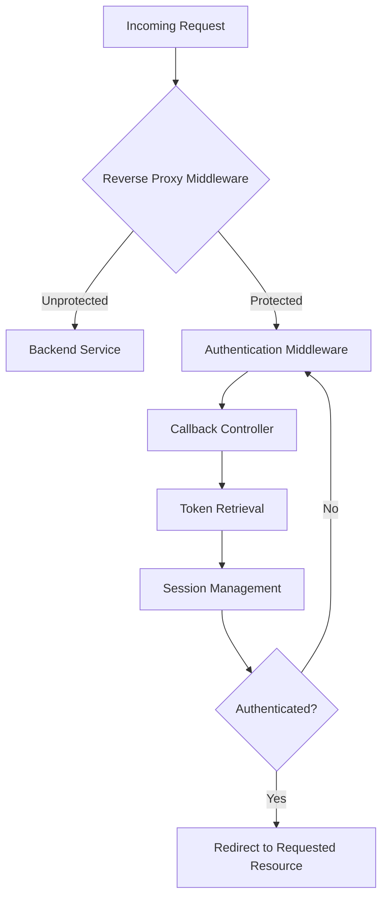

# **Reverse Proxy with Authentication Middleware (OIDC and SAML Support)**  

This repository provides a modular Reverse Proxy implementation using **ASP.NET Core (3.1)**. It features:  
- Reverse Proxy Middleware for routing requests to backend services.  
- Authentication Middleware for handling OIDC and SAML authentication.  
- Callback Controller for processing authorization code responses and handling token retrieval.  
- Complete session management and redirection to originally requested protected resources.  
- Support for modifying request/response headers and injecting additional content into responses.  

---

## **Table of Contents**
1. [Overview](#overview)  
2. [Architecture](#architecture)  
3. [Project Structure](#project-structure)  
4. [Configuration](#configuration)  
5. [Middleware Components](#middleware-components)  
6. [Callback Controller](#callback-controller)  
7. [Session Management](#session-management)  


---

## **Overview**  
This project implements a Reverse Proxy with authentication for secure access to backend services. The Reverse Proxy intercepts requests and determines if they require authentication. If authentication is needed, the request is redirected to the appropriate identity provider (OIDC or SAML). After successful authentication, the originally requested resource is served.  

---

## **Architecture**  
### **Flow Diagram**  


---

## **Project Structure**  
```
/Middlewares
    - ReverseProxyMiddleware.cs
    - AuthenticationMiddleware.cs
/Controllers
    - CallbackController.cs
/Models
    - AppSettings.cs
/Startup.cs
/Program.cs
appSettings.json
```

### **Key Components**  
- **ReverseProxyMiddleware.cs**: Handles routing of requests to backend services and ensures proper response handling (headers and content modification).  
- **AuthenticationMiddleware.cs**: Intercepts protected requests and redirects unauthenticated users to the authentication provider.  
- **CallbackController.cs**: Handles the OIDC/SAML callback, processes the authorization code, retrieves tokens, and establishes the authenticated user session.  
- **Startup.cs**: Configures middleware pipeline, services, and session management.  
- **Program.cs**: Entry point of the application.
- **appSettings.json: Configures kestrel server with dns name for the host, certificate for SSL and authentication configuration (Authentication is configured with Auth0 in this sample). 

---

## **Configuration**  

### **PFX Certificate generation**
- On a Mac
	- Open terminal and use the openssl command to generate a private key and a self-signed certificate with a dns name.
```bash
openssl req -x509 -newkey rsa:2048 -keyout private.key -out certificate.crt -days 365 -nodes \
  -subj "/C=US/ST=California/L=San Francisco/O=MyOrganization/CN=mydomain.com" \
  -addext "subjectAltName=DNS:example.org.com,DNS:example.org.com"

```
	- Convert the certificat to PFX format
```bash
openssl pkcs12 -export -out certificate.pfx -inkey private.key -in certificate.crt -passout pass:yourpassword

``` 


### **appSettings.json Configuration**
Add kestrel server configuration, certificate configuration and Auth0 configuration in `appSettings.json`.
```json
"Auth0": {
    "Domain":"example.us.auth0.com",
    "ClientId":"clientId",
    "ClientSecret": "clientSecret",
    "RedirectUri":"https://example.org.com/callback"
 },
  "Kestrel": {
    "Endpoints": {
      "Http": {
        "Url": "http:/example.org.com"
      },
      "Https": {
        "Url": "https://example.org.com",
	"Certificate": {
		"Path": "pathToPFXFile",
		"Password": "passwordForPFXFile"
      }
  }
```

### **Reverse Proxy Middleware Configuration**
Add your backend service routes and define which paths require authentication in `ReverseProxyMiddleware.cs`.  
```csharp
if (!context.Request.Path.StartsWithSegments("/auth") && !context.Request.Path.StartsWithSegments("/callback"))
{
    // Process request normally or redirect to authentication
}
```

### **Authentication Middleware**  
Configures OIDC or SAML for handling user authentication.  

### **Callback Endpoint**  
`/callback`: This endpoint processes the authorization code and retrieves tokens for establishing a session.

---

## **Middleware Components**  

### **ReverseProxyMiddleware.cs**  
```csharp
public class ReverseProxyMiddleware
{
    private readonly RequestDelegate _next;

    public ReverseProxyMiddleware(RequestDelegate next)
    {
        _next = next;
    }

    public async Task Invoke(HttpContext context)
    {
        if (context.Request.Path.StartsWithSegments("/callback"))
        {
            await _next(context);  // Pass to CallbackController
            return;
        }

        // Proxy logic: modify request, add headers, etc.
    }
}
```

### **AuthenticationMiddleware.cs**  
```csharp
public class AuthenticationMiddleware
{
    private readonly RequestDelegate _next;

    public AuthenticationMiddleware(RequestDelegate next)
    {
        _next = next;
    }

    public async Task Invoke(HttpContext context)
    {
        if (!context.User.Identity.IsAuthenticated)
        {
            context.Response.Redirect("/auth/login");
            return;
        }

        await _next(context);
    }
}
```

---

## **Callback Controller**  
- Handles the `/callback` endpoint to process the authorization code and retrieve tokens.
- Decodes tokens, parses and stores in session.


## **Session Management**  
- Uses `HttpContext.Session` to store token data and authentication status.  
- Ensures session persistence across middleware and controllers.   

---

## **Running the Application**  

1. **Clone the Repository:**  
   ```bash
   git clone https://github.com/v-2amisi/ReverseProxy.git
   cd ReverseProxy
   ```

2. **Install Dependencies:**  
   Ensure you have .NET Core 3.1 SDK installed.  

3. **Build and Run the Application:**  
   ```bash
   dotnet restore
   dotnet build
   dotnet run
   ```

4. **Access the Application:**  
   Visit `https://localhost:5000` in your browser.  

---

## **Future Enhancements**  
- Add support for SAML.  
- Implement OAuth client credentials flow for reverse proxy to act as a client for internal authorization server.  
- Add role-based authorization.  

---


